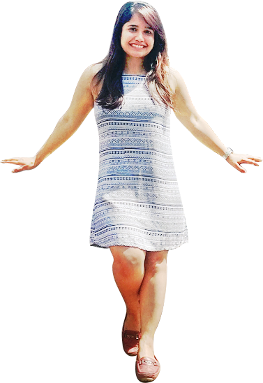

### Hi there 👋

  

  

  

    

        I am Priyanka a budding🌱 fullstack developer based in Copenhagen(Denmark). I made a lot of small demos🤖 in this account. Besides that i am a foodie🍲 and love to travel✈️.

<!--
**priyankapandey13/priyankapandey13** is a ✨ _special_ ✨ repository because its `README.md` (this file) appears on your GitHub profile. -->

 

- 🔭 I’m currently working on something cool...
- 🌱 I’m currently learning new stack...
- 💬 Ask me about my projects...
- 📫 How to reach me: <a href="https://www.linkedin.com/in/priyanka-sharma-b882121a/">Linkedin</a>...
- ⚡ Fun fact: You can never be less awesome...

<!-- 
- 👯 I’m looking to collaborate on ...
- 😄 Pronouns: ...
- 🤔 I’m looking for help with ...
-->
